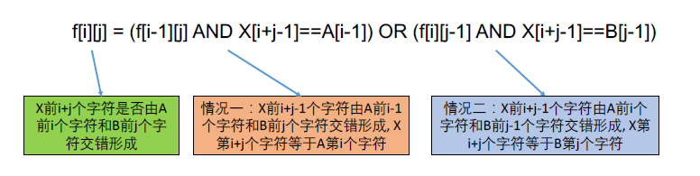

[TOC]

## 题目

### [29. Interleaving String](https://www.lintcode.com/problem/interleaving-string/description)

- Given three strings: *s1*, *s2*, *s3*, determine whether *s3* is formed by the interleaving of *s1* and *s2*.

  ### Example

  **Example 1:**

  ```
  Input:
  "aabcc"
  "dbbca"
  "aadbbcbcac"
  Output:
  true
  ```

  **Example 2:**

  ```
  Input:
  ""
  ""
  "1"
  Output:
  false
  ```

  **Example 3:**

  ```
  Input:
  "aabcc"
  "dbbca"
  "aadbbbaccc"
  Output:
  false
  ```

  ### Challenge

  O(n2) time or better

## 思路

双序列型动态规划

转移方程



## 代码

```python
class Solution:
    """
    @param s1: A string
    @param s2: A string
    @param s3: A string
    @return: Determine whether s3 is formed by interleaving of s1 and s2
    """
    def isInterleave(self, s1, s2, s3):
        # write your code here
        
        l = len(s1)
        m = len(s2)
        n = len(s3)
        
        if l + m != n:
            return False
        
        # f[i][j] s1的前i个字符串和s2的前j个字符串 能否组成 s3的前i+j个
        f = [[False] *(m+1) for _ in range(l+1)]
        for i in range(l+1):
            for j in range(m+1):
                if i == 0 and j == 0:
                    f[0][0] = True
                if i > 0 and s1[i-1] == s3[i+j-1]:
                    f[i][j] = f[i][j] or f[i-1][j]
                if j > 0 and s2[j-1] == s3[i+j-1]:
                    f[i][j] = f[i][j] or f[i][j-1]
        return f[l][m]        
```

