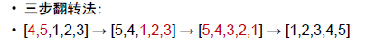

[TOC]

## 题目

### [39. Recover Rotated Sorted Array](https://www.lintcode.com/problem/recover-rotated-sorted-array/description)

Given a **rotated** sorted array, recover it to sorted array in-place.（Ascending）

### Example

**Example1:**
`[4, 5, 1, 2, 3]` -> `[1, 2, 3, 4, 5]`
**Example2:**
`[6,8,9,1,2]` -> `[1,2,6,8,9]`

### Challenge

In-place, O(*1*) extra space and O(*n*) time.

### Clarification

What is rotated array?

- For example, the orginal array is [1,2,3,4], The rotated array of it can be [1,2,3,4], [2,3,4,1], [3,4,1,2], [4,1,2,3]

## 思路

先找出旋转轴，再进行三步反转法

这里代码用的方法是暴力查找旋转轴，其实可以采用二分法查找

> 关于三步反转法
>
> 

## 代码

```python
class Solution:
    """
    @param nums: An integer array
    @return: nothing
    """
    def recoverRotatedSortedArray(self, nums):
        # write your code here
        ind = -1
        for i in range(len(nums)-1):
            if nums[i] > nums[i+1]:
                ind = i
                break
        if ind  == -1:
            return nums
        self.rever(nums, 0, ind)
        self.rever(nums, ind+1, len(nums)-1)
        self.rever(nums, 0, len(nums)-1)
        return nums
        
    def rever(self, nums, i, j):
        while i < j:
            tmp = nums[i]
            nums[i] = nums[j]
            nums[j] = tmp
            i += 1
            j -= 1
```

