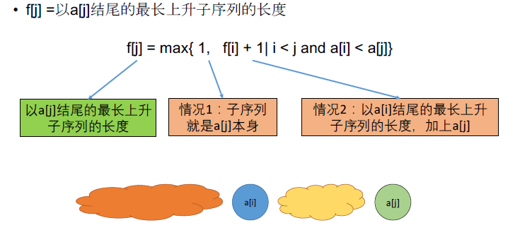

[TOC]

## 题目

### [76. Longest Increasing Subsequence](https://www.lintcode.com/problem/longest-increasing-subsequence/description)

Given a sequence of integers, find the longest increasing subsequence (LIS).

You code should return the length of the LIS.

### Example

```
Example 1:
	Input:  [5,4,1,2,3]
	Output:  3
	
	Explanation:
	LIS is [1,2,3]


Example 2:
	Input: [4,2,4,5,3,7]
	Output:  4
	
	Explanation: 
	LIS is [2,4,5,7]
```

### Challenge

Time complexity O(n^2) or O(nlogn)

### Clarification

What's the definition of longest increasing subsequence?

- The longest increasing subsequence problem is to find a subsequence of a given sequence in which the subsequence's elements are in sorted order, lowest to highest, and in which the subsequence is as long as possible. This subsequence is not necessarily contiguous, or unique.
- [https://en.wikipedia.org/wiki/Longest_increasing_subsequence](https://en.wikipedia.org/wiki/Longest_increasing_subsequence%22)

## 思路

最长序列型动态规划题目



这样做的时间复杂度是$O(n^2)$

可以优化到$O(nlogn)$，应该会在最后一节课有涉及

动态规划专题课扩展：打印出LIS序列，基本思路是记录状态的转换过程，然后倒着推理出最长序列

## 代码

```python
class Solution:
    """
    @param nums: An integer array
    @return: The length of LIS (longest increasing subsequence)
    """
    def longestIncreasingSubsequence(self, nums):
        # write your code here
        return self.solve(nums)
        
    def solve(self, nums):
        # 时间复杂度O(n^2)
        n = len(nums)
        if n == 0:
            return 0
        
        DP = [0 for i in range(n)]
        path = [0 for i in range(n)]
        DP[0] = 1
        for i in range(1, n):
            DP[i] = 1;
            for j in range(i):
                if nums[i] > nums[j]:
                    DP[i] = max(DP[i], DP[j] + 1)
                    if DP[i] == DP[j] + 1: path[i] = j
        
        res = max(DP)
        Id = DP.index(res)
        LIS = [0 for i in range(res)]
        i = 0
        
        # 打印出LIS序列
        for i in range(res-1,-1,-1):
            LIS[i] = nums[Id]
            Id = path[Id]
        print(LIS)
        return res
```

