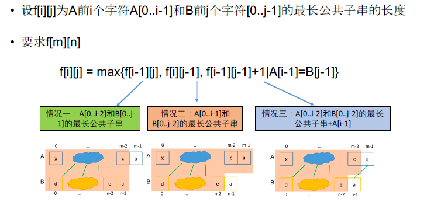

[TOC]

## 题目

### [77. Longest Common Subsequence](https://www.lintcode.com/problem/longest-common-subsequence/description)

Given two strings, find the longest common subsequence (*LCS*).

Your code should return the length of *LCS*.

### Example

```
Example 1:
	Input:  "ABCD" and "EDCA"
	Output:  1
	
	Explanation:
	LCS is 'A' or  'D' or 'C'


Example 2:
	Input: "ABCD" and "EACB"
	Output:  2
	
	Explanation: 
	LCS is "AC"
```

### Clarification

What's the definition of Longest Common Subsequence?

- <https://en.wikipedia.org/wiki/Longest_common_subsequence_problem>
- <http://baike.baidu.com/view/2020307.htm>

## 思路

双序列型动态规划

* 转移方程如下：
  * 
* 时间复杂度$O(MN)$，空间复杂度可以使用滚动数组优化至$O(N)$
* 打印出LCS的方法如代码所示


## 代码

```python
class Solution:
    """
    @param A: A string
    @param B: A string
    @return: The length of longest common subsequence of A and B
    """
    def longestCommonSubsequence(self, A, B):
        # write your code here
        return self.solve(A, B)
    
    def solve(self, A, B):
        
        n1 = len(A)
        n2 = len(B)
        
        if n1 == 0 or n2 == 0:
            return 0
        
        p = [[0]*(n2+1) for _ in range(n1+1)]
        f = [[0]*(n2+1) for _ in range(n1+1)]
        # f[i][j] A中前i个 与B中前j个的最长公共子串
        
        for i in range(1, n1+1):
            for j in range(1, n2+1):
                f[i][j] = max(f[i-1][j], f[i][j-1])
                if f[i][j] == f[i-1][j]:
                    p[i][j] = 0
                else:
                    p[i][j] = 1
                if A[i-1] == B[j-1]:
                    f[i][j] = max(f[i][j], f[i-1][j-1] + 1)
                    if f[i][j] == f[i-1][j-1] + 1:
                        p[i][j] = 2
        
        out = []
        m = 0
        i = n1
        j = n2
        while m < f[n1][n2]:
            if p[i][j] == 0:
                i = i - 1
                continue
            if p[i][j] == 1:
                j = j - 1
                continue
            if p[i][j] == 2:
                out.insert(0, A[i-1])
                i = i - 1
                j = j - 1
                m = m + 1
        print(''.join(out))
        return f[n1][n2]
```

