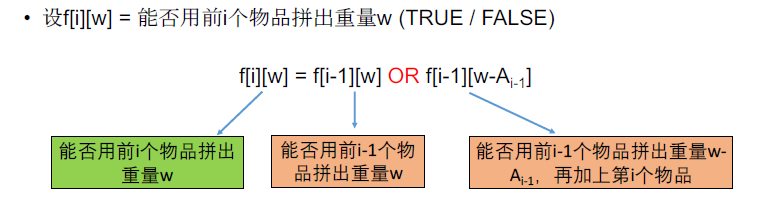
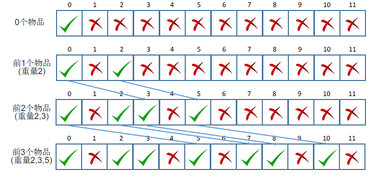

[TOC]

## 题目

### [92. Backpack](https://www.lintcode.com/problem/backpack/description)

Given *n* items with size Ai, an integer *m* denotes the size of a backpack. How full you can fill this backpack?

### Example

```
Example 1:
	Input:  [3,4,8,5], backpack size=10
	Output:  9

Example 2:
	Input:  [2,3,5,7], backpack size=12
	Output:  12
	
```

### Challenge

O(n x m) time and O(m) memory.

O(n x m) memory is also acceptable if you do not know how to optimize memory.

### Notice

You can not divide any item into small pieces.

## 思路

0-1背包型动态规划题目

* 背包问题， 状态应该包含背包重量，并且背包重量是在内循环内的。

* 常见误区：==错误== 设$f[i]$表示前$i​$个物品能拼出的最大重量(不超过M)

  * 反例：A=[3,9,5,2] M=10
  * 错误原因：最优策略中，前N-1个物品拼出的不一定是不超过M的最大重量

* 

* 0-1背包问题的空间优化。一维数组，内循环，即背包重量的循环部分，倒序遍历即可：

  

## 代码

```python
class Solution:
    """
    @param m: An integer m denotes the size of a backpack
    @param A: Given n items with size A[i]
    @return: The maximum size
    """
    def backPack(self, m, A):
        # write your code here
        return self.solve(m, A)
    
    def solve(self, m , A):
        
        # O(n x m) time and O(m) memory
        
        n = len(A)
        if n == 0:
            return 0
        
        # DP[i][j] 前i个物品能否拼出重量j
        DP = [0 for i in range(m+1)]
        
        DP[0] = 1
        for i in range(1, n+1):     # 前i个物品
            for j in range(m, -1, -1): # 能否拼出重量j
                if j-A[(i-1)] >= 0:
                    DP[j] = DP[j-A[i-1]] | DP[j]
        
        id1 = 0            
        for i in range(m, -1, -1):
            if DP[i] == 1:
                id1 = i
                break
        return id1
```

