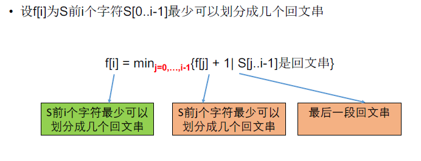

[TOC]

## 题目

### [108. Palindrome Partitioning II](https://www.lintcode.com/problem/palindrome-partitioning-ii/description)

Given a string `s`, cut `s` into some substrings such that every substring is a palindrome.

Return the **minimum** cuts needed for a palindrome partitioning of *s*.

### Example

**Example 1:**

```
Input: "a"
Output: 0
Explanation: "a" is already a palindrome, no need to split.
```

**Example 2:**

```
Input: "aab"
Output: 1
Explanation: Split "aab" once, into "aa" and "b", both palindrome.
```

## 思路

划分型动态规划题目

为了减少时间复杂度，提前找出所有的回文串，也算是一个技巧。



* 关于回文串的判断

```markdown
从字符串的每一个字符向两边扩展。考虑奇数长度和偶数长度的回文串。时间复杂度$O(n^2)$
```

## 代码

```python
class Solution:
    """
    @param s: A string
    @return: An integer
    """
    def minCut(self, s):
        # write your code here
        return self.solve(s)
        
    def solve(self, s):
        
        # 时间复杂度O(n^3) 
        n = len(s)
        if n == 0:
            return 0
        # DP[i] 最小回文串数目
        DP = [0 for i in range(n+1)]
        
        DP[0] = 0
        for i in range(1, n+1):
            DP[i] = i
            for j in range(i):
                tmp = s[j:i]
                if tmp == tmp[::-1]:
                    DP[i] = min(DP[j]+1, DP[i])
        return DP[n]-1
    
    def solve1(self, s):
        # 先找出所有的回文串，再动态规划，这样减少时间复杂度
        # 时间复杂度O(n^2) 
        n = len(s)
        if n == 0:
            return 0
        # DP[i] 最小分割次数 
        
        Flag = self.isPalin(s)
        
        DP = [0 for i in range(n+1)]
        DP[0] = 0
        for i in range(1, n+1):
            DP[i] = i 
            for j in range(0,i):
                #tmp = s[j:i+1]
                if Flag[j][i-1] == 1:
                    DP[i] = min(DP[j]+1, DP[i])
        return DP[n]-1
    
    def isPalin(self, s):
        n = len(s)
        Flag = [[0 for i in range(n)] for j in range(n)]
        for i in range(n):
            Flag[i][i] = 1
            for j in range(1, n//2+2):
                if i-j >= 0 and i+j <=n-1:
                    if s[i-j] == s[i+j]:
                        Flag[i-j][i+j] = 1
                    else:
                        break
            for j in range(n//2):
                if i+j+1 <= n-1 and i-j >= 0:
                    if s[i+j+1] == s[i-j]:
                        Flag[i-j][i+j+1] = 1
                    else: 
                        break
        return Flag            
```

