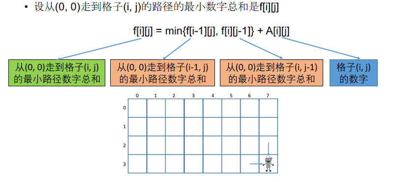

[TOC]

## 题目

### [110. Minimum Path Sum](https://www.lintcode.com/problem/minimum-path-sum/description)

Given a **m x n** grid filled with non-negative numbers, find a path from top left to bottom right which ***minimizes*** the sum of all numbers along its path.

### Example

```
Example 1:
	Input:  [[1,3,1],[1,5,1],[4,2,1]]
	Output: 7
	
	Explanation:
	Path is: 1 -> 3 -> 1 -> 1 -> 1


Example 2:
	Input:  [[1,3,2]]
	Output: 6
	
	Explanation:  
	Path is: 1 -> 3 -> 2
```

### Notice

You can only go right or down in the path..

## 思路

坐标型动态规划题目

需要注意边界情况：i=0或者j=0



## 代码

```python
class Solution:
    """
    @param grid: a list of lists of integers
    @return: An integer, minimizes the sum of all numbers along its path
    """
    def minPathSum(self, grid):
        # write your code here
        return self.solve1(grid);
    
    def solve(self, grid):
        
        m = len(grid)
        n = len(grid[0])
        
        if n == 0 or m == 0:
            return 0
        
        # DP[m][n] 表示[0,0]点到[m,n]点的最小路径和    
        DP = [[0 for i in range(n)] for j in range(m)]
        
        DP[0][0] = grid[0][0]
        for i in range(m):
            for j in range(n):
                if i == 0:
                    DP[i][j] = grid[i][j] + DP[i][j-1]
                    continue
                if j == 0:
                    DP[i][j] = grid[i][j] + DP[i-1][j]
                    continue
                DP[i][j] = grid[i][j] + min(DP[i-1][j], DP[i][j-1])
        return DP[m-1][n-1]
        
    # 优化空间复杂度    
    def solve1(self, grid):
        
        m = len(grid)
        n = len(grid[0])
        
        if n == 0 or m == 0:
            return 0   
        
        DP = [[0 for i in range(n)] for j in range(2)]
        DP[0][0] = grid[0][0]
        
        old = now = 0;
        for i in range(m):
            old = now
            now = 1 - now
            for j in range(n):
                if i == 0:
                    DP[now][j] = grid[i][j] + DP[now][j-1]
                    continue
                if j == 0:
                    DP[now][j] = grid[i][j] + DP[old][0]
                    continue
                DP[now][j] = grid[i][j] + min(DP[old][j], DP[now][j-1])
                
        return DP[now][n-1]   
```

