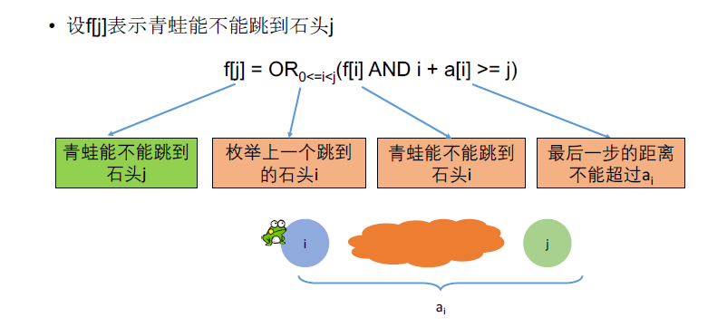

[TOC]

## 题目

### [116. Jump Game](https://www.lintcode.com/problem/jump-game/description)

Given an array of non-negative integers, you are initially positioned at the first index of the array.

Each element in the array represents your maximum jump length at that position.

Determine if you are able to reach the last index.

### Example

***Example 1***

```
Input : [2,3,1,1,4]
Output : true
```

***Example 2***

```
Input : [3,2,1,0,4]
Output : false
```

### Notice

This problem have two method which is `Greedy` and `Dynamic Programming`.

The time complexity of `Greedy` method is `O(n)`.

The time complexity of `Dynamic` Programming method is `O(n^2)`.

We manually set the small data set to allow you pass the test in both ways. This is just to let you learn how to use this problem in dynamic programming ways. If you finish it in dynamic programming ways, you can try greedy method to make it accept again.

## 思路

序列型动态规划题目？

这一题我一开始没有想出来怎么做。其实很简单

状态设定：$f[i]$表示青蛙能不能跳到石头$i$。



## 代码

```python
class Solution:
    """
    @param A: A list of integers
    @return: A boolean
    """
    def canJump(self, A):
        # write your code here
        
        # 采用动态规划
        return self.DP(A);
        
    def DP(self, A):
        # DP Solution
        f = [False for i in A];
        # f[i] 表示青蛙能不能跳到i
        length = len(A);
        f[0] = True;
        for j in range(1, length):
            f[j] = False;
            for i in range(0, j):
                f[j] = f[j] or (f[i] and i + A[i] >= j);
        return f[length-1]; 
```

