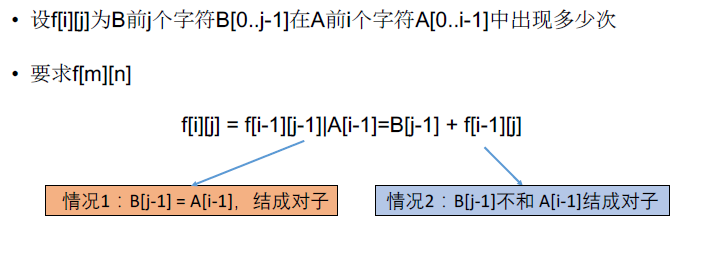

[TOC]

## 题目

### [118. Distinct Subsequences](https://www.lintcode.com/problem/distinct-subsequences/description)

Given two strings `S` and `T`. Count the number of distinct subsequences of `S` which equals `T`.

A subsequence of a string is a new string which is formed from the original string by deleting some (can be none) of the characters without disturbing the relative positions of the remaining characters. (ie, `"ACE"` is a subsequence of `"ABCDE"` while `"AEC"` is not)

### Example

**Example 1:**

```
Input: S = "rabbbit", T = "rabbit"
Output: 3
Explanation: You could remove any 'b' in S, so there are 3 ways to get T.
```

**Example 2:**

```
Input: S = "abcd", T = ""
Output: 1
Explanation: There is only 1 way to get T - remove all chars in S.
```

### Challenge

Do it in O(n^2*n*2) time and O(n) memory.

O(n^2*n*2) memory is also acceptable if you do not know how to optimize memory.

## 思路

双序列型动态规划



需要注意的是初始化的问题。如果B为空串，则B在A中出现的次数为1.

## 代码

```python
class Solution:
    """
    @param S: A string
    @param T: A string
    @return: Count the number of distinct subsequences
    """
    def numDistinct(self, S, T):
        # write your code here
        return self.solve(S, T)
        
    def solve(self, S, T):
        
        m = len(S)
        n= len(T)
        

        # f[m][n] S中前m个字符串含有多少不同的T中前n个字符串
        f = [[0]*(n+1) for _ in range(2)]
        for i in range(m+1):
            for j in range(n+1):
                if i == 0 and j == 0:
                    f[0][0] = 1
                    continue
                if i == 0:
                    f[0][j] = 0
                    continue
                if j == 0:
                    f[i%2][0] = 1
                    continue
                f[i%2][j] = f[(i-1)%2][j]
                if S[i-1] == T[j-1]:
                    f[i%2][j] += f[(i-1)%2][j-1]
        return f[m%2][n]
```

