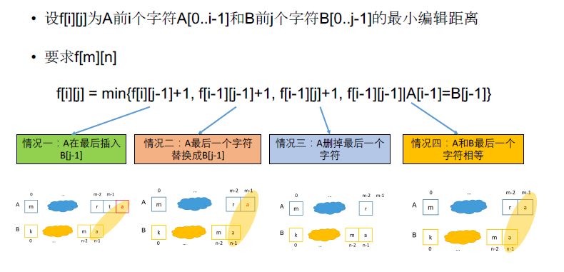

[TOC]

## 题目

### [119. Edit Distance](https://www.lintcode.com/problem/edit-distance/description)

Given two words *word1* and *word2*, find the minimum number of steps required to convert word1 to word2. (each operation is counted as 1 step.)

You have the following 3 operations permitted on a word:

- Insert a character
- Delete a character
- Replace a character

### Example

**Example 1:**

```
Input: 
"horse"
"ros"
Output: 3
Explanation: 
horse -> rorse (replace 'h' with 'r')
rorse -> rose (remove 'r')
rose -> ros (remove 'e')
```

**Example 2:**

```
Input: 
"intention"
"execution"
Output: 5
Explanation: 
intention -> inention (remove 't')
inention -> enention (replace 'i' with 'e')
enention -> exention (replace 'n' with 'x')
exention -> exection (replace 'n' with 'c')
exection -> execution (insert 'u')
```

## 思路

双序列型动态规划



## 代码

```python
class Solution:
    """
    @param word1: A string
    @param word2: A string
    @return: The minimum number of steps.
    """
    def minDistance(self, word1, word2):
        # write your code here
        
        m = len(word1)
        n = len(word2)
        
        if m == 0:
            return n
        if n == 0:
            return m
        
        # f[m][n] word1的前m个字符变为word2的前n个字符    
        f = [[100000]*(n+1) for _ in range(m+1)]
        for i in range(m+1):      # word1
            for j in range(n+1):  # word2
                if i == 0:
                    f[0][j] = j
                    continue
                if j == 0:
                    f[i][0] = i
                    continue
                if word1[i-1] == word2[j-1]:
                    f[i][j] = f[i-1][j-1]
                    continue
                f[i][j] = min(f[i][j-1], f[i-1][j-1], f[i-1][j]) + 1
        return f[m][n]
```

