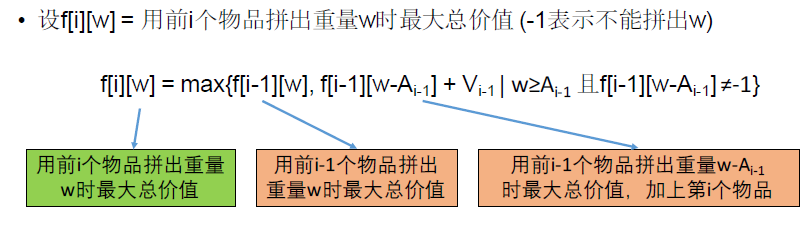

[TOC]

## 题目

### [125. Backpack II](https://www.lintcode.com/problem/backpack-ii/description)

There are `n` items and a backpack with size `m`. Given array `A` representing the size of each item and array `V` representing the value of each item.

What's the maximum value can you put into the backpack?

### Example

**Example 1:**

```
Input: m = 10, A = [2, 3, 5, 7], V = [1, 5, 2, 4]
Output: 9
Explanation: Put A[1] and A[3] into backpack, getting the maximum value V[1] + V[3] = 9 
```

**Example 2:**

```
Input: m = 10, A = [2, 3, 8], V = [2, 5, 8]
Output: 10
Explanation: Put A[0] and A[2] into backpack, getting the maximum value V[0] + V[2] = 10 
```

### Challenge

O(nm) memory is acceptable, can you do it in O(m) memory?

### Notice

1. `A[i], V[i], n, m` are all integers.
2. You can not split an item.
3. The sum size of the items you want to put into backpack can not exceed `m`.
4. Each item can only be picked up once

## 思路

0-1背包型动态规划

* 

## 代码

```python
class Solution:
    """
    @param m: An integer m denotes the size of a backpack
    @param A: Given n items with size A[i]
    @param V: Given n items with value V[i]
    @return: The maximum value
    """
    def backPackII(self, m, A, V):
        # write your code here
        return self.solve(m, A, V)
        
    def solve(self, m, A, V):
        
        #n 个物品和一个大小为 m 的背包
        # DP[n][m] 前n个物品凑出重量m的最大总价值
        
        n = len(A)
        if n == 0:
            return 0
            
        # DP = [[0 for i in range(m+1)] for j in range(2)]
        
        # DP[m] 表示装到重量为m时候的最大价值
        DP = [0 for i in range(m+1)]
        
        DP[0] = 0
        for i in range(1, n+1):         # 前i个物品
            for j in range(m, -1, -1):  # 倒推更新DP[j]
                if j-A[i-1] >= 0:
                    DP[j] = max(DP[j], DP[j-A[i-1]] + V[i-1])
                
        return max(DP)
```

