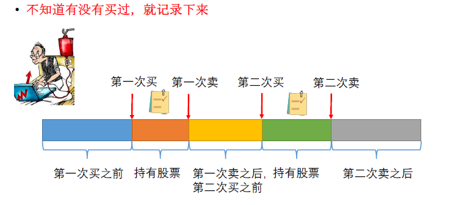
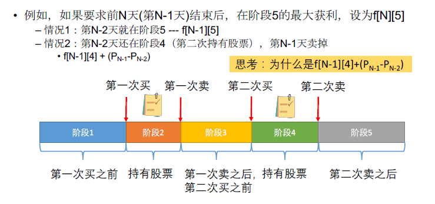
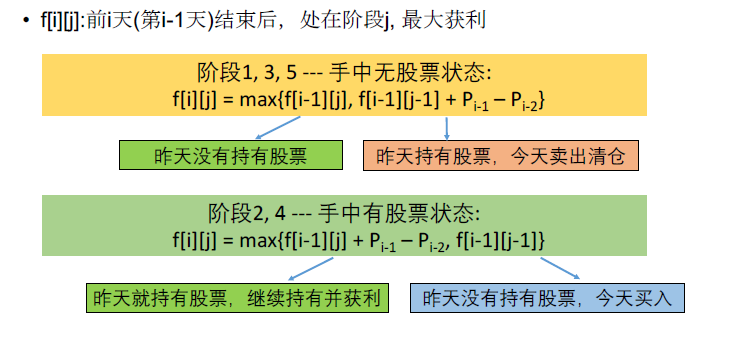

[TOC]

## 题目

### [151. Best Time to Buy and Sell Stock III](https://www.lintcode.com/problem/best-time-to-buy-and-sell-stock-iii/description)

Say you have an array for which the *i*th element is the price of a given stock on day *i*.

Design an algorithm to find the **maximum** profit. You may complete at most *two* transactions.

### Example

***Example 1***

```
Input : [4,4,6,1,1,4,2,5]
Output : 6
```

### Notice

You may not engage in multiple transactions at the same time (ie, you must sell the stock before you buy again).

## 思路

序列型动态规划

这一题最多交易两次。没有明显的状态。所以需要自己设计状态，分为第几次买入前/卖出后/持有中

* 不知道买没买过，就记录下来

  

  

  

        # DP[i][j]表示前i天（第i-1天）结束后，在阶段j的最大获利。注意，是当前的最大获利，只要股票在手，
        # 获利就是随着当天价格变化的
        
        # 阶段0：第一次买之前；
        # 第一次买
        # 阶段1：持有股票
        # 第一次卖
        # 阶段2：第一次卖之后，第二次买之前
        # 第二次买
        # 阶段3：持有股票
        # 第二次卖
        # 阶段4：第二次卖之后
## 代码

```python
class Solution:
    """
    @param prices: Given an integer array
    @return: Maximum profit
    """
    def maxProfit(self, prices):
        # write your code here
        return self.solve(prices)
        
    def solve(self, prices):       
        n = len(prices)
        if n == 0:
            return 0
        
        DP = [[0 for i in range(5)] for j in range(n+1)]
        
        for i in range(2, n+1):
            DP[i][0] = DP[i-1][0]
            DP[i][1] = max(DP[i-1][1] + prices[i-1] - prices[i-2], DP[i-1][0])
            DP[i][2] = max(DP[i-1][1] + prices[i-1] - prices[i-2], DP[i-1][2])
            DP[i][3] = max(DP[i-1][3] + prices[i-1] - prices[i-2], DP[i-1][2])
            DP[i][4] = max(DP[i-1][4], DP[i-1][3] + prices[i-1] - prices[i-2])
        return max(DP[n][0], DP[n][2], DP[n][4])
        # 因为最多只能买卖两次，所以只看卖出0,1,2次的状态
```

