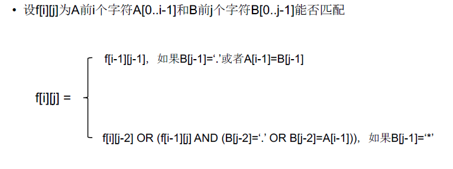

[TOC]

## 题目

### [154. Regular Expression Matching](https://www.lintcode.com/problem/regular-expression-matching/description)

Implement regular expression matching with support for `'.'` and `'*'`.

```
'.' Matches any single character.
'*' Matches zero or more of the preceding element.
The matching should cover the entire input string (not partial).
The function prototype should be:

bool isMatch(string s, string p)
```


isMatch("aa","a") → false

isMatch("aa","aa") → true

isMatch("aaa","aa") → false

isMatch("aa", "a*") → true

isMatch("aa", ".*") → true

isMatch("ab", ".*") → true

isMatch("aab", "c*a*b") → true

### Example

**Example 1:**

```
Input："aa"，"a"
Output：false
Explanation：
unable to match
```

**Example 2:**

```
Input："aa"，"a*"
Output：true
Explanation：
'*' can repeat a
```

## 思路

双序列型动态规划

* 转移方程
  * 
* 初始化：
  * 空串对空正则表达式，$f[0][0]=True$
  * 空的正则表达式不能匹配长度大于0的串:$f[1][0] = f[2][0]=\cdots=f[m][0]=False$
  * $f[0][1\cdots n]$也是用动态规划计算
## 代码

```python
class Solution:
    """
    @param s: A string 
    @param p: A string includes "." and "*"
    @return: A boolean
    """
    def isMatch(self, s, p):
        # write your code here
        return self.solve(s, p)
    
    def solve(self, s, p):
        
        m = len(s)
        n = len(p)
        
        # f[m][n] s的前m个字符匹配p的前n个字符
        f = [[False]*(n+1) for _ in range(m+1)]
        
        for i in range(m+1):
            for j in range(n+1):
                if j == 0 and i == 0:
                    f[0][0] = True
                    continue
                if i>0 and j>0 and s[i-1] == p[j-1]:
                    f[i][j] = f[i][j] or f[i-1][j-1]
                if i>0 and j>0 and p[j-1] == ".":
                    f[i][j] = f[i][j] or f[i-1][j-1]
                if j-2 >= 0 and p[j-1] == "*":
                    f[i][j] = f[i][j] or f[i][j-2] # 匹配0次
                    if i>0 and (s[i-1] == p[j-2] or p[j-2] == '.'):
                        f[i][j] = f[i][j] or f[i-1][j]
        return f[m][n]
```

