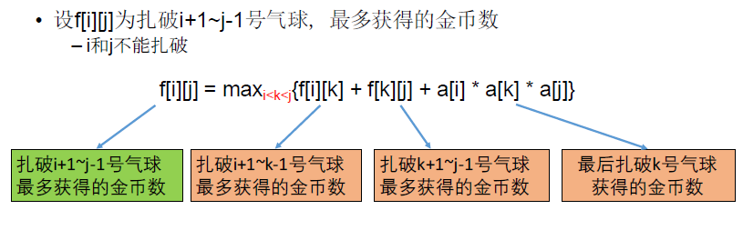

[TOC]

## 题目

### [168. Burst Balloons](https://www.lintcode.com/problem/burst-balloons/description)

Given `n` balloons, indexed from `0` to `n-1`. Each balloon is painted with a number on it represented by array `nums`. You are asked to burst all the balloons. If the you burst balloon `i` you will get `nums[left] * nums[i] * nums[right]` coins. Here left and right are adjacent indices of i. After the burst, the left and right then becomes adjacent.

Find the `maximum` coins you can collect by bursting the balloons wisely.

### Example

**Example 1:**

```
Input：[4, 1, 5, 10]
Output：270
Explanation：
nums = [4, 1, 5, 10] burst 1, get coins 4 * 1 * 5 = 20
nums = [4, 5, 10]   burst 5, get coins 4 * 5 * 10 = 200 
nums = [4, 10]    burst 4, get coins 1 * 4 * 10 = 40
nums = [10]    burst 10, get coins 1 * 10 * 1 = 10
Total coins 20 + 200 + 40 + 10 = 270
```

**Example 2:**

```
Input：[3,1,5]
Output：35
Explanation：
nums = [3, 1, 5] burst 1, get coins 3 * 1 * 5 = 15
nums = [3, 5] burst 3, get coins 1 * 3 * 5 = 15
nums = [5] burst 5, get coins 1 * 5 * 1 = 5
Total coins 15 + 15 + 5  = 35
```

### Notice

- You may imagine `nums[-1] = nums[n] = 1`. They are not real therefore you can not burst them.
- 0 ≤ `n` ≤ 500, 0 ≤ `nums[i]` ≤ 100

## 思路

区间型动态规划题目

* 不要顺着题目意思走。思考最后一个扎破的气球是哪一个。这个气球的两边的气球扎破得到奖励是互不影响的，因为两边被最后扎破的气球隔开
* 

## 代码

```python
class Solution:
    """
    @param nums: A list of integer
    @return: An integer, maximum coins
    """
    def maxCoins(self, nums):
        # write your code here
        return self.solve(nums)
        
    def solve(self, nums):
        
        n = len(nums)
        if n == 0:
            return 0
        nums.insert(0, 1)
        nums.append(1)
        n = len(nums)
        # f[i][j] 为扎破i+1 ~ j-1号气球，最多获得的金币数
        # f[i][j] = k = i+1...j-1 max(max( f[i][k],f[k][j])+nums[k])
        f = [[0]*n for _ in range(n)]
        
        # 0 到 n个气球
        # 0 1..... n-2 n-1
        
        for length in range(3, n+1):
            for i in range(n-length+1):
                j = i + length-1
                f[i][j] = 0
                for k in range(i+1, j):
                    f[i][j] = max(f[i][j], f[i][k] + f[k][j] + nums[i]*nums[k]*nums[j])   
        return f[0][n-1]
```

