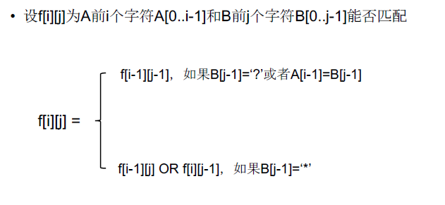
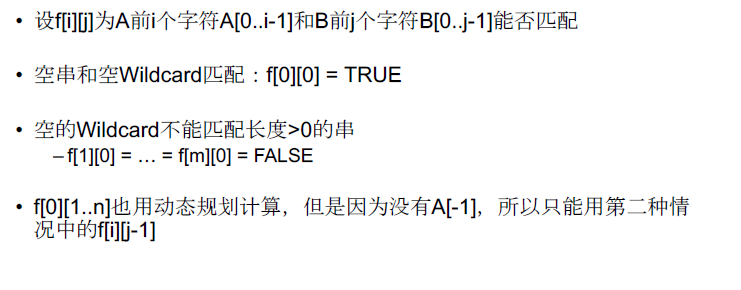

[TOC]

## 题目

### [192. Wildcard Matching](https://www.lintcode.com/problem/wildcard-matching/description)

Implement wildcard pattern matching with support for `'?'` and `'*'`.

- `'?'` Matches any single character.
- `'*'` Matches any sequence of characters (including the empty sequence).

The matching should cover the entire input string (not partial).

### Example

**Example 1**

```plain
Input:
"aa"
"a"
Output: false
```

**Example 2**

```plain
Input:
"aa"
"aa"
Output: true
```

**Example 3**

```plain
Input:
"aaa"
"aa"
Output: false
```

**Example 4**

```plain
Input:
"aa"
"*"
Output: true
Explanation: '*' can replace any string
```

**Example 5**

```plain
Input:
"aa"
"a*"
Output: true
```

**Example 6**

```plain
Input:
"ab"
"?*"
Output: true
Explanation: '?' -> 'a' '*' -> 'b'
```

**Example 7**

```plain
Input:
"aab"
"c*a*b"
Output: false
```

## 思路

双序列型动态规划题目

* 转移方程
  * 
* 边界情况
  * 

## 代码

```python
class Solution:
    """
    @param s: A string 
    @param p: A string includes "?" and "*"
    @return: is Match?
    """
    def isMatch(self, s, p):
        # write your code here
        return self.solve(s, p)
    
    def solve(self, s, p):
        
        m = len(s)
        n = len(p)
        f = [[False]*(n+1) for _ in range(m+1)]
        
        # 
        for i in range(m+1):
            for j in range(n+1):
                if i == 0 and j == 0:
                    f[0][0] = True
                    continue
                if j == 0:
                    f[i][0] = False
                    continue
                if i > 0 and p[j-1] == s[i-1] or p[j-1] == '?':
                    f[i][j] |= f[i-1][j-1]
                    continue
                if p[j-1] == '*':
                    f[i][j] |= f[i][j-1]
                    if i > 0:
                        f[i][j] |= f[i-1][j]
        return f[m][n]
```

