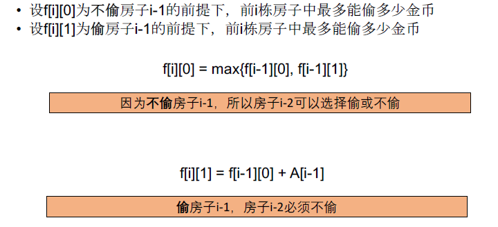

[TOC]

## 题目

### [392. House Robber](https://www.lintcode.com/problem/house-robber/description)

You are a professional robber planning to rob houses along a street. Each house has a certain amount of money stashed, the only constraint stopping you from robbing each of them is that adjacent houses have security system connected and **it will automatically contact the police if two adjacent houses were broken into on the same night**.

Given a list of non-negative integers representing the amount of money of each house, determine the maximum amount of money you can rob tonight **without alerting the police**.

### Example

**Example 1:**

```
Input: [3, 8, 4]
Output: 8
Explanation: Just rob the second house.
```

**Example 2:**

```
Input: [5, 2, 1, 3]
Output: 8
Explanation: Rob the first and the last house.
```

### Challenge

O(n) time and O(1) memory.

## 思路

序列型动态规划题目。两种思路，第二种思路是第一种思路的简化。

第一种思路，记录i-1栋房子是否盗窃



第二种思路，简化第一种思路，其实就是第i栋房子可以偷或者不偷的两种情况。偷的话，只用关心前i-2个房子盗窃的最大价值；不偷的话，就只看前i-1个房子的最大价值。

## 代码

```python
class Solution:
    """
    @param A: An array of non-negative integers
    @return: The maximum amount of money you can rob tonight
    """
    def houseRobber(self, A):
        # write your code here
        return self.solve1(A)
        
    def solve1(self, A):
        
        n = len(A)
        if n == 0:
            return 0
        
        # DP[i][2] 盗取(j = 1) 和 不盗取(j=0) 第i个房子的情况下的最大收益
        # DP[i][0] = max(DP[i-1][0], DP[i-1][1])
        # DP[i][1] = DP[i-1][0] + A[i]
        # 时间复杂度 O(n) 空间复杂度O(1)
        
        DP = [[0 for i in range(2)] for j in range(2)]
        
        now, old = 0, 0
        for i in range(1, n+1):
            old = now
            now = 1 - now          
            DP[now][0] = max(DP[old][0], DP[old][1])
            DP[now][1] = A[i-1] + DP[old][0]
        return max(DP[now])
        
    def solve2(self, A):
        
        n = len(A)
        if n == 0: return 0
            
        # DP[i] 前i栋房子最多可以投多少金币
        # DP[i] = max(DP[i-1], DP[i-2] + A[i]);
        DP = [0 for i in range(3)]
        for i in range(1, n+1):
            if i == 1:
                DP[1] = A[0]
                continue
            DP[i%3] = max(DP[(i-1)%3], DP[(i-2)%3] + A[i-1])
        return DP[n%3]
```

