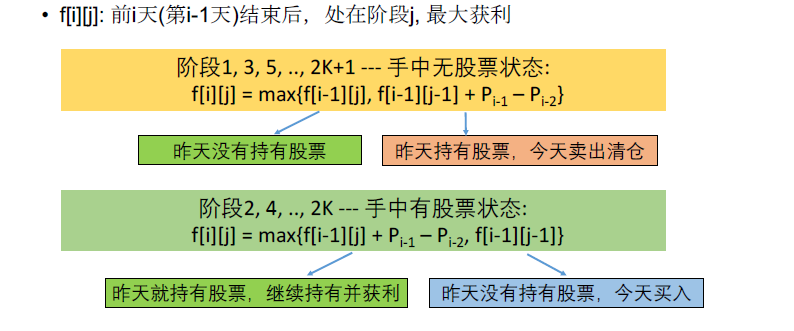
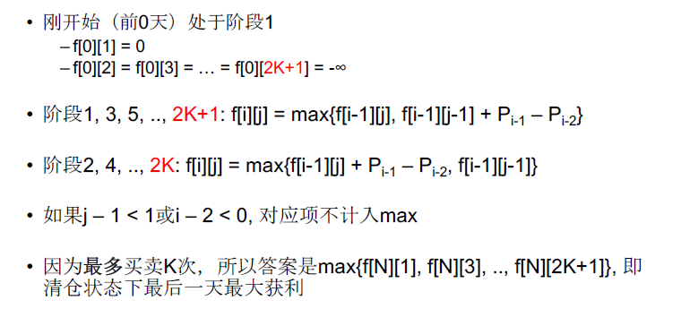

[TOC]

## 题目

### [393. Best Time to Buy and Sell Stock IV](https://www.lintcode.com/problem/best-time-to-buy-and-sell-stock-iv/description)

Given an array `prices` and the `i-th` element of it represents the price of a stock on the `i-th` day.

**You may complete at most k transactions.** What's the maximum profit?

### Example

**Example 1:**

```
Input: k = 2, prices = [4, 4, 6, 1, 1, 4, 2 ,5]
Output: 6
Explanation: Buy at 4 and sell at 6. Then buy at 1 and sell at 5. Your profit is 2 + 4 = 6.
```

**Example 2:**

```
Input: k = 1, prices = [3, 2, 1]
Output: 0
Explanation: No transaction.
```

### Challenge

O(nk) time. `n` is the size of `prices`.

### Notice

You may not engage in multiple transactions at the same time (i.e., you must sell the stock before you buy again).

## 思路

序列型动态规划题目。

两点注意的地方：1.更加抽象化的状态描述；2. 注意k次和任意多次的区别，转化为任意多次，可以避免超时





## 代码

```python
class Solution:
    """
    @param K: An integer
    @param prices: An integer array
    @return: Maximum profit
    """
    def maxProfit(self, K, prices):
        # write your code here
        return self.solve(K, prices)
        
    def solve(self, K, prices):
        n = len(prices);
        if n == 0 or n == 1:
            return 0
        
        # 如果K > n/2， 则转化为买卖任意多次获得的最大收益；
        if K > n/2:
            min1 = prices[0]
            res = 0
            for i in range(1, n):
                if prices[i] - prices[i-1] > 0:
                    res += prices[i] - prices[i-1]
            return res
        
        # DP[i][j] 第i天第i状态的最大获益
        DP = [[0 for j in range(2*K+1)] for i in range(2)]
        
        for i in range(1, n):
            for j in range(1, 2*K+1):
                if j & 1 == 0:
                # 偶数状态，即买之前
                    DP[i % 2][j] = max(DP[(i-1) % 2][j], DP[(i-1) % 2][j-1] + prices[i] - prices[i-1])
                    continue
                if j & 1 == 1:
                # 奇数状态，即卖之前
                    DP[i % 2][j] = max(DP[(i-1) % 2][j]+prices[i] - prices[i-1], DP[(i-1) % 2][j-1])
                
        return max(DP[(n-1)%2])
```

