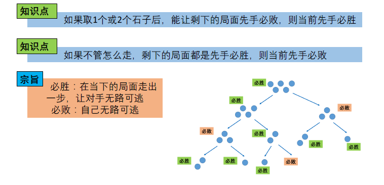
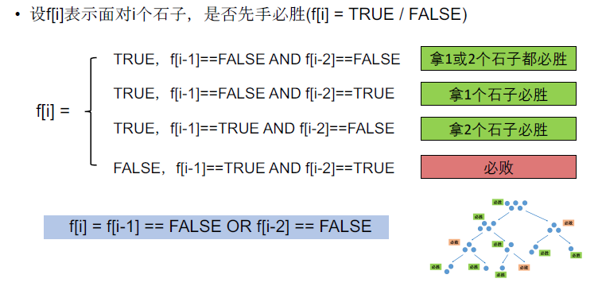

[TOC]

## 题目

### [394. Coins in a Line](https://www.lintcode.com/problem/coins-in-a-line/description)

There are `n` coins in a line. Two players take turns to take one or two coins from right side until there are no more coins left. The player who take the last coin wins.

Could you please decide the **first** player will win or lose?

If the first player wins, return `true`, otherwise return `false`.

### Example

**Example 1:**

```
Input: 1
Output: true
```

**Example 2:**

```
Input: 4
Output: true
Explanation:
The first player takes 1 coin at first. Then there are 3 coins left.
Whether the second player takes 1 coin or two, then the first player can take all coin(s) left.
```

### Challenge

O(1) time and O(1) memory

## 思路

两种方式：

* 找规律： 时间复杂度达到$O(1)​$的时间和空间
* 动态规划方式
  * 博弈型。博弈型动态规划一般从第一步分析，而不是最后一步。
    * 
    * 

## 代码

```python
class Solution:
    """
    @param n: An integer
    @return: A boolean which equals to true if the first player will win
    """
    def firstWillWin(self, n):
        # write your code here
        return self.solve(n)
        
    def solve(self, n):
        
        # DP[n]  n个硬币是否先手必胜
        # DP[n-1]=0 DP[n-2]=0 -> DP[n] = 1
        # DP[n] = !( DP[n-1] & DP[n-2])
        if n == 0:
            return False
        if n == 1:
            return True
            
        # O(1) 存储
        DP = [0 for i in range(3)]
        DP[0] = True
        DP[1] = True
        for i in range(2, n):
            DP[i % 3] = not (DP[(i-1) % 3] & DP[(i-2) % 3])
        return DP[(n-1) % 3]
        
    def solve1(self, n):
        
        # O(1) 时间复杂度且O(1) 存储
        if n == 0:
            return False
        if n % 3 == 0:
            return False
        return True
        
```

