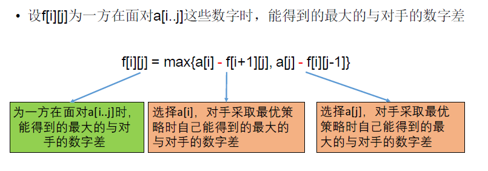

[TOC]

## 题目

### [396. Coins in a Line III](https://www.lintcode.com/problem/coins-in-a-line-iii/description)

There are `n` coins in a line, and value of `i-th` coin is `values[i]`.

Two players take turns to take a coin from one of the ends of the line until there are no more coins left. The player with the larger amount of money wins.

Could you please decide **the first player** will win or lose?

### Example

**Example 1:**

```
Input: [3, 2, 2]
Output: true
Explanation: The first player takes 3 at first. Then they both take 2.
```

**Example 2:**

```
Input: [1, 20, 4]
Output: false
Explanation: The second player will take 20 whether the first player take 1 or 4.
```

### Challenge

O(1) memory and O(n) time when `n` is even.

## 思路

参考了答案

* 此题的关键是转换为求自己的数字和与对手的数字和的差值
* 

## 代码

```python
class Solution:
    """
    @param values: a vector of integers
    @return: a boolean which equals to true if the first player will win
    """
    def firstWillWin(self, values):
        # write your code here
        return self.solve1(values)
    
    def solve(self, values):
        
        n = len(values)
        
        if n == 0:
            return 0
        
        if n == 1:
            return True
        
        if n & 1 == 0:
            return True
        
        # 先手能够获得的最大价值
        DP = [[0 for i in range(n)] for j in range(n)]
        
        for length in range(1, n+1):
            for i in range(n-length+1):
                if length == 1:
                    DP[i][i] = values[i]
                    continue
                if length == 2:
                    DP[i][i+1] = max(values[i], values[i+1])
                    continue
                j = i + length -1
                tmp1 = values[i] + min(DP[i+2][j], DP[i+1][j-1])
                tmp2 = values[j] + min(DP[i+1][j-1], DP[i][j-2])
                DP[i][j] = max(tmp1, tmp2)
        return True if DP[0][n-1] >= DP[1][n-1] or DP[0][n-1] >= DP[0][n-2] else False
    
    def solve1(self, values):
        
        n = len(values)
        if n == 0:
            return 0
        if n == 1 or n & 1 == 0:
            return True
        # 先手能得到的与对手最大的数字差
        DP = [[0 for i in range(n)] for j in range(n)]
        for i in range(n-1, -1, -1):
            for j in range(i, n):
                if i == j:
                    DP[i][j] = values[i]
                    continue
                DP[i][j] = max(values[i] - DP[i+1][j], values[j] - DP[i][j-1])
        
        return True if DP[0][n-1] >= 0 else False
```

