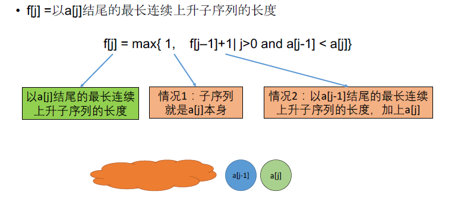

[TOC]

## 题目

### [397. Longest Continuous Increasing Subsequence](https://www.lintcode.com/problem/longest-continuous-increasing-subsequence/description)

Give an integer array，find the longest increasing continuous subsequence in this array.

An increasing continuous subsequence:

- Can be from right to left or from left to right.
- Indices of the integers in the subsequence should be continuous.

### Example

**Example 1:**

```
Input: [5, 4, 2, 1, 3]
Output: 4
Explanation:
For [5, 4, 2, 1, 3], the LICS  is [5, 4, 2, 1], return 4.
```

**Example 2:**

```
Input: [5, 1, 2, 3, 4]
Output: 4
Explanation:
For [5, 1, 2, 3, 4], the LICS  is [1, 2, 3, 4], return 4.
```

### Challenge

O(n) time and O(1) extra space.

## 思路

序列型动态规划题目。

分别对序列正序和逆序求一次，即可得到结果。

这里我写的O(1)解法好像是非动态规划的，很奇怪...。对于动态规划的解法，应该是用滚动数组优化到O(1)空间。



## 代码

```python
class Solution:
    """
    @param A: An array of Integer
    @return: an integer
    """
    def longestIncreasingContinuousSubsequence(self, A):
        # write your code here
        return max(self.solve1(A), self.solve1(list(reversed(A))) )
    
    def solve(self, A):
        
        n = len(A)
        if n == 0:
            return 0
        
        # DP[n] 以A[n]结尾的最长递增子序列长度
        DP = [0 for i in range(n)]
        DP[0] = 1
        for i in range(1, n):
            DP[i] = DP[i-1] + 1 if A[i] >= A[i-1] else 1
        return max(DP)
    
    def solve1(self, A):
        # 空间复杂度O(1)的解法
        n = len(A)
        if n == 0:
            return 0
        
        num = 1
        tmp = 1
        for i in range(1, n):
            tmp = tmp + 1 if A[i] >= A[i-1] else 1
            num = max(tmp, num)
        return num
```

