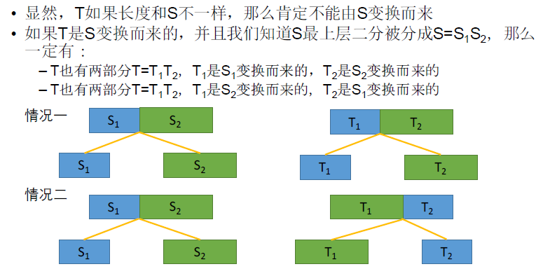
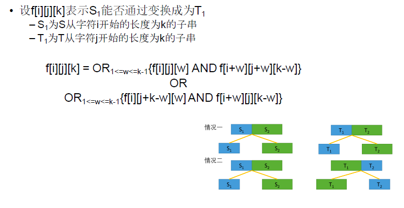

[TOC]

## 题目

### [430. Scramble String](https://www.lintcode.com/problem/scramble-string/description)

Given a string `s1`, we may represent it as a binary tree by partitioning it to two non-empty substrings recursively.

Below is one possible representation of `s1 = "great"`:

```
    great
   /    \
  gr    eat
 / \    /  \
g   r  e   at
           / \
          a   t
```

To scramble the string, we may choose any non-leaf node and swap its two children.

For example, if we choose the node `"gr"` and swap its two children, it produces a scrambled string `"rgeat"`.

```
    rgeat
   /    \
  rg    eat
 / \    /  \
r   g  e   at
           / \
          a   t
```

We say that `"rgeat"` is a scrambled string of `"great"`.

Similarly, if we continue to swap the children of nodes `"eat"` and `"at"`, it produces a scrambled string `"rgtae"`.

```
    rgtae
   /    \
  rg    tae
 / \    /  \
r   g  ta  e
       / \
      t   a
```

We say that `"rgtae"` is a scrambled string of `"great"`.

Given two strings `s1` and `s2` of the same length, determine if `s2` is a scrambled string of `s1`.

### Example

**Example 1:**

```
Input: s1 = "great", s2 = "rgeat"
Output: true
Explanation: As described above.
```

**Example 2:**

```
Input: s1 = "a", s2 = "b"
Output: false
```

### Challenge

O(n3) time

### Notice

You can start scrambling from any binary tree legally built from `s1`, but you can not rebuild another binary tree while you are scrambling to get `s2`.

## 思路

* 区间型动态规划
* 注意状态的缩减优化
  * 
  * 

## 代码

```python
class Solution:
    """
    @param s1: A string
    @param s2: Another string
    @return: whether s2 is a scrambled string of s1
    """
    def isScramble(self, s1, s2):
        # write your code here
        return self.solve(s1, s2)
        
    def solve(self, s1, s2):
        
        # f[i][j][k][h] T[k...h]是否由S[i...j]变换而来
        # f[7][0][5] S中位置7开始的，T中0位置开始的，长度为5的子串是否互相变换而来
        # f[i][j][k] 表示S从字符i开始的长度为k的子串能否变为T从字符j开始的长度为k的子串
        
        # f[i][j][k] 
        
        if len(s1) != len(s2):
            return False
        n = len(s1)
        f = [[[0]*(n+1) for _ in range(n)] for _ in range(n)]
        
        for i in range(n):
            for j in range(n):
                if s1[i] == s2[j]:
                    f[i][j][1] = True
                    continue
                f[i][j][1] = False
        
        for k in range(2, n+1):
            for i in range(n-k+1):
                for j in range(n-k+1):
                    tmp1 = False
                    tmp2 = False
                    f[i][j][k] = False
                    for w in range(1, k):
                        tmp1 = tmp1 or (f[i][j][w] and f[i+w][j+w][k-w])
                        tmp2 = tmp2 or (f[i][j+k-w][w] and f[i+w][j][k-w])
                        '''
                        if f[i][j][w] and f[i+w][j+w][k-w]:
                            f[i][j][k] = True
                            break
                        if f[i][j+k-w][w] and f[i+w][j][k-w]:
                            f[i][j][k] = True
                            break
                        '''
                    f[i][j][k] = tmp1 or tmp2
        return f[0][0][n]
```

