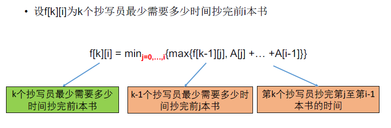

[TOC]

## 题目

### [437. Copy Books](https://www.lintcode.com/problem/copy-books/description)

Given `n` books and the `i-th` book has `pages[i]` pages. There are `k` persons to copy these books.

These books list in a row and each person can claim a continous range of books. For example, one copier can copy the books from `i-th` to `j-th` continously, but he can not copy the 1st book, 2nd book and 4th book (without 3rd book).

They start copying books at the same time and they all cost 1 minute to copy 1 page of a book. What's the best strategy to assign books so that the slowest copier can finish at earliest time?

Return the shortest time that the slowest copier spends.

### Example

**Example 1:**

```
Input: pages = [3, 2, 4], k = 2
Output: 5
Explanation: 
    First person spends 5 minutes to copy book 1 and book 2.
    Second person spends 4 minutes to copy book 3.
```

**Example 2:**

```
Input: pages = [3, 2, 4], k = 3
Output: 4
Explanation: Each person copies one of the books.
```

### Challenge

O(nk) time

### Notice

The sum of book pages is less than or equal to 2147483647

## 思路

两种解法：

* 动态规划
  * 划分型动态规划
  * 时间复杂度$O(N^2K)$
  * 
* 二分答案
  * 二分答案更加直接，难点在于check函数的书写，需要考虑完整
  * 一句话描述题意：将数组切分为k个子数组，让子数组和的最大值保持最小
  * 时间复杂度$O(nlog(sum(pages)))​$

## 代码

* 按照二分法模版写的解答

```python
class Solution:
    """
    @param pages: an array of integers
    @param k: An integer
    @return: an integer
    """
    def copyBooks(self, pages, k):
        # write your code here
        # 二分答案    
        if not pages:
            return 0
        
        start, end = max(pages), sum(pages)
        while start + 1 < end:
            mid = (start + end) // 2
            if self.check(pages, k, mid):
                end = mid
            else:
                start = mid
        if self.check(pages, k, start):
            return start
        if self.check(pages, k, end):
            return end
    
    def check(self, pages, k, mid):
        # mid越小 需要的人越多 k越大 找到小于等于k的
        num = 0
        tmp = 0
        for item in pages:
            if tmp + item <= mid:
                tmp += item
                continue
            tmp = item
            num += 1
        num += 1
        # mid为答案的话 最少需要num个人
        return True if k >= num else False
```

* 九章官网给出的动态规划答案

```python
class Solution:
    """
    @param pages: an array of integers
    @param k: An integer
    @return: an integer
    """

    def copyBooks(self, pages, k):
        n = len(pages)
        if k > n:
            k = n

        if n == 0:
            return 0

        sum = [0] * n
        sum[0] = pages[0]
        for i in range(1, n):
            sum[i] = sum[i - 1] + pages[i]

        f = [[0] * k for _ in range(n)]

        for i in range(n):
            f[i][0] = sum[i]

        for j in range(1, k):
            p = 0
            f[0][j] = pages[0]
            for i in range(1, j):
                f[i][j] = max(f[i - 1][j], pages[i])

            for i in range(j, n):
                while (p < i and f[p][j - 1] < sum[i] - sum[p]):
                    p += 1
                f[i][j] = max(f[p][j - 1], sum[i] - sum[p])
                if p > 0:
                    p -= 1
                f[i][j] = min(f[i][j], max(f[p][j - 1], sum[i] - sum[p]))
        return f[n-1][k-1]
```

