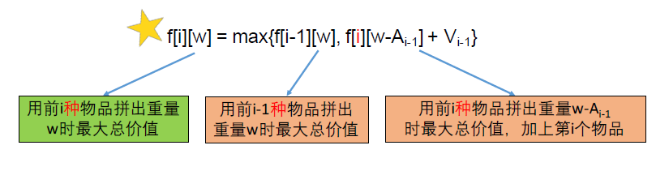
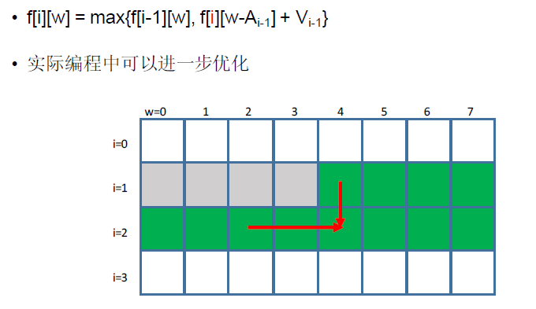

[TOC]

## 题目

### [440. Backpack III](https://www.lintcode.com/problem/backpack-iii/description)

Given `n` kinds of items, and each kind of item has an infinite number available. The `i-th` item has size `A[i]` and value `V[i]`.

Also given a backpack with size `m`. What is the maximum value you can put into the backpack?

### Example

**Example 1:**

```
Input: A = [2, 3, 5, 7], V = [1, 5, 2, 4], m = 10
Output: 15
Explanation: Put three item 1 (A[1] = 3, V[1] = 5) into backpack.
```

**Example 2:**

```
Input: A = [1, 2, 3], V = [1, 2, 3], m = 5
Output: 5
Explanation: Strategy is not unique. For example, put five item 0 (A[0] = 1, V[0] = 1) into backpack.
```

### Notice

1. You cannot divide item into small pieces.
2. Total size of items you put into backpack can not exceed `m`.

## 思路

* 经典的完全背包问题
* 经典转移方程：
  * 
* 经典优化，内循环顺序遍历即可：
  * 

## 代码

```python
class Solution:
    """
    @param A: an integer array
    @param V: an integer array
    @param m: An integer
    @return: an array
    """
    def backPackIII(self, A, V, m):
        # write your code here
        return self.solve2(A, V, m)
        
    def solve1(self, A, V, m):
        n = len(A)
        if n == 0:
            return 0
        
        # 拼出重量i时候得到的最大总价值
        DP = [0 for i in range(m+1)]
        
        DP[0] = 0
        
        for i in range(1, n+1):
            for j in range(0, m+1):
                if j-A[i-1] < 0:
                    continue
                DP[j] = max(DP[j], DP[j-A[i-1]] + V[i-1])
                    
        return max(DP[m])
        
    def solve2(self, A, V, m):
        
        n = len(A)
        if n == 0:
            return 0
            
        DP = [[0 for i in range(m+1)] for j in range(n+1)]
        
        for i in range(1, n+1):
            for j in range(m+1):
                DP[i][j] = DP[i-1][j]
                if j-A[i-1] < 0:
                    continue 
                DP[i][j] = max(DP[i][j], DP[i][j-A[i-1]] + V[i-1])
        
        return DP[n][m]
```

