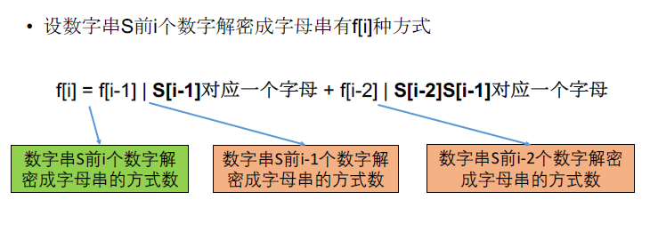

[TOC]

## 题目

### [512. Decode Ways](https://www.lintcode.com/problem/decode-ways/description)

A message containing letters from `A-Z` is being encoded to numbers using the following mapping:

```
'A' -> 1
'B' -> 2
...
'Z' -> 26
```

Given an encoded message containing digits, determine the total number of ways to decode it.

### Example

**Example 1:**

```
Input: "12"
Output: 2
Explanation: It could be decoded as AB (1 2) or L (12).
```

**Example 2:**

```
Input: "10"
Output: 1
```

### Notice

we can't decode an empty string. So you should return 0 if the message is empty.

## 思路

划分型动态规划题目。

这个题目不难，但是需要多写多实践。对于Corner Case需要多加练习。思维需要特别清晰。



## 代码

```python
class Solution:
    """
    @param s: a string,  encoded message
    @return: an integer, the number of ways decoding
    """
    def numDecodings(self, s):
        # write your code here
        return self.solve1(s)
    
    def solve(self, s):
        
        n = len(s)
        if n == 0:
            return 0
        c = [0 for i in range(n)]
        
        # 还需要考虑0的情况
        for i in range(n):
            if i == 0:
                c[i] = 1 if s[i] != '0' else 0
                continue
            
            num = int("".join(s[i-1:i+1]))
            if num == 0:
                c[i] = 0
                continue
            if num > 26:
                c[i] = c[i-1] if int(s[i]) != 0 else 0
            if num < 10:
                c[i] = c[i-1]
                continue
            if num == 20 or num == 10:
                c[i] = c[i-2] if i > 1 else 1
                continue
            if num <= 26 and num >= 11:
                c[i] = c[i-1] + c[i-2] if i > 1 else 2
        return c[n-1]
        
    def solve1(self, s):
        
        n = len(s)
        if n == 0:
            return 0
        
        c = [0 for i in range(n+1)];
        c[0] = 1
        for i in range(1, n+1):
            if int(s[i-1]) >= 1 and int(s[i-1]) <= 9:
                c[i] += c[i-1]
            
            if i > 1:
                num = int("".join(s[i-2:i]))
                if num >= 10 and num <= 26:
                    c[i] += c[i-2]
        return c[n]
```

