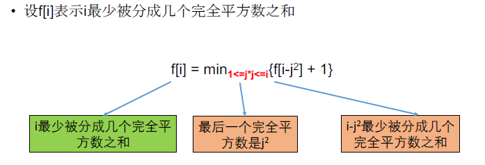

[TOC]

## 题目

### [513. Perfect Squares](https://www.lintcode.com/problem/perfect-squares/description)

Given a positive integer `n`, find the least number of perfect square numbers (for example, `1, 4, 9, 16, ...`) which sum to n.

### Example

**Example 1:**

```
Input: 12
Output: 3
Explanation: 4 + 4 + 4
```

**Example 2:**

```
Input: 13
Output: 2
Explanation: 4 + 9
```

## 思路

划分型动态规划题目。



## 代码

```python
class Solution:
    """
    @param n: a positive integer
    @return: An integer
    """
    def numSquares(self, n):
        # write your code here
        return self.solve(n)
        
    def solve(self, n):
        
        if n == 0:
            return 0
        
        # DP[i] 第i个数最少多少个完全平方数的和
        # DP[i] = min(DP[i], DP[i - j^2] + 1)
        DP = [0 for i in range(n+1)]
        
        DP[1] = 1
        for i in range(2, n+1):
            DP[i] = 1000000
            for j in range(int(i**0.5)+1):
                DP[i] = min(DP[i], DP[i - j**2] + 1)
        return DP[n]
```

