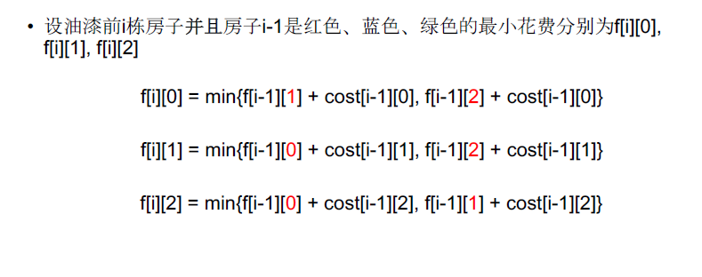

[TOC]

## 题目

### [515. Paint House](https://www.lintcode.com/problem/paint-house/description)

There are a row of `n` houses, each house can be painted with one of the three colors: red, blue or green. The cost of painting each house with a certain color is different. You have to paint all the houses such that **no two adjacent houses have the same color,** and you need to cost the least. Return the minimum cost.

The cost of painting each house with a certain color is represented by a `n` x `3` cost matrix. For example, `costs[0][0]` is the cost of painting house `0` with color red; `costs[1][2]` is the cost of painting house `1` with color green, and so on... Find the minimum cost to paint all houses.

### Example

**Example 1:**

```
Input: [[14,2,11],[11,14,5],[14,3,10]]
Output: 10
Explanation: Paint house 0 into blue, paint house 1 into green, paint house 2 into blue. Minimum cost: 2 + 5 + 3 = 10.
```

**Example 2:**

```
Input: [[1,2,3],[1,4,6]]
Output: 3
```

### Notice

All costs are positive integers.

## 思路

序列型动态规划题目。重点是需要在DP表中记录状态。$DP[i][j]$表示前$j$个房子，并且$j-1$个房子是红色，蓝色和绿色的最小花费



## 代码

```python
class Solution:
    """
    @param costs: n x 3 cost matrix
    @return: An integer, the minimum cost to paint all houses
    """
    def minCost(self, costs):
        # write your code here
        return self.solve(costs);
        
    def solve(self, costs):
        n = len(costs);
        DP = [[0 for i in range(3)] for j in range(n)]
        
        if n == 0:
            return 0
        
        for i in range(n):
            for j in range(3):
                if i == 0:
                    DP[i][j] = costs[i][j]
                    continue
                tmp = [t for t in range(3) if t !=j]
                DP[i][j] = min(DP[i-1][tmp[0]]+costs[i][j], DP[i-1][tmp[1]]+costs[i][j])
        
        return  min(DP[n-1])
```

