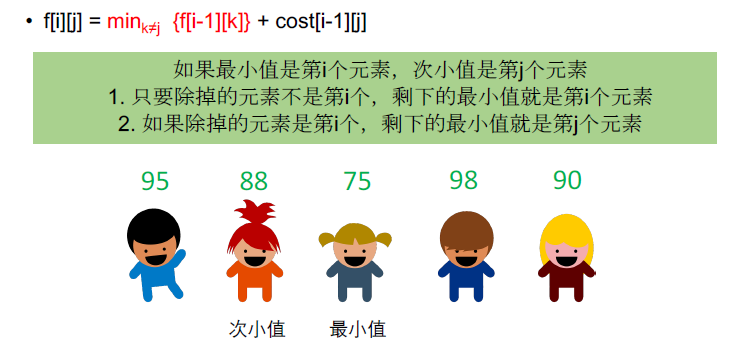

[TOC]

## 题目

### [516. Paint House II](https://www.lintcode.com/problem/paint-house-ii/description)

There are a row of `n` houses, each house can be painted with one of the `k` colors. The cost of painting each house with a certain color is different. You have to paint all the houses such that no two adjacent houses have the same color.

The cost of painting each house with a certain color is represented by a `n` x `k` cost matrix. For example, `costs[0][0]` is the cost of painting house `0` with color `0`; `costs[1][2]` is the cost of painting house `1` with color `2`, and so on... Find the minimum cost to paint all houses.

### Example

**Example 1**

```plain
Input:
costs = [[14,2,11],[11,14,5],[14,3,10]]
Output: 10
Explanation:
The three house use color [1,2,1] for each house. The total cost is 10.
```

**Example 2**

```plain
Input:
costs = [[5]]
Output: 5
Explanation:
There is only one color and one house.
```

### Challenge

Could you solve it in O(nk)?

### Notice

All costs are positive integers.

## 思路

序列型动态规划题目。重点是需要在DP表中记录状态。$DP[i][j]$表示第i个房子染成k色的最小方案

这一题的重点是优化时间复杂度到$O(nk)​$。需要求取除去某一个数之外其他元素的最小值，那么这里涉及到一个常见的优化方案。



所以这里就设计到$O(n)$时间内求取最小值和次小值，可以使用两个变量分别记录，按照条件更新。


## 代码

```python
class Solution:
    """
    @param costs: n x k cost matrix
    @return: an integer, the minimum cost to paint all houses
    """
    def minCostII(self, costs):
        # write your code here
        return self.solve(costs)
        
    def solve(self, costs):
        
        m = len(costs) # 房子数
        if m:
            n = len(costs[0])  # 颜色数
            
        if m == 0 or n == 0:
            return 0
            
        # DP[i][k] 第i个房子染k色最小的方案
        DP = [[0 for i in range(n)] for j in range(m)]

        for i in range(m):
            for j in range(n):
                DP[i][j] = costs[i][j]
                if i > 0:
                    DP[i][j] += DP[i-1][l1] if j != l1 else DP[i-1][l2]
            l1, l2 = self.findmin(DP[i])
        return min(DP[m-1])
    
    def findmin(self, cost):
        min1 = 1000000000 # 最小值
        min2 = min1 + 1   # 次小值
        l1, l2 = 0, 0
        for i in range(len(cost)):
            if cost[i] < min2:
                if cost[i] < min1:
                    min2 = min1
                    min1 = cost[i]
                    l2 = l1
                    l1 = i
                    continue
                min2 = cost[i]
                l2 = i
        return l1, l2
```

