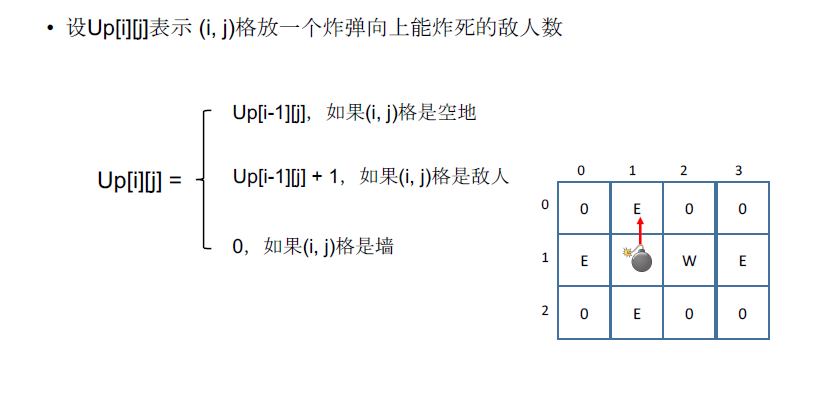
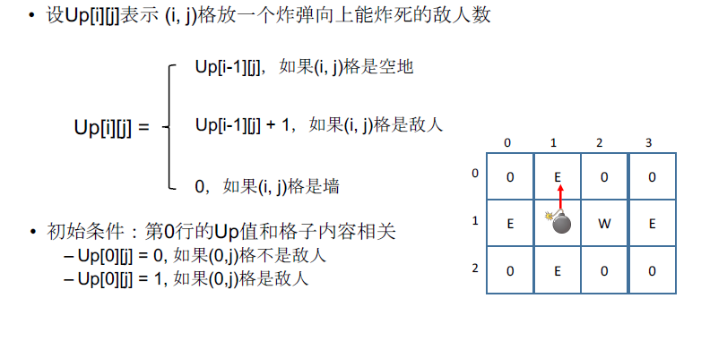
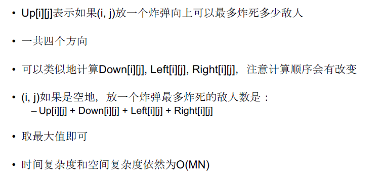

[TOC]

## 题目

### [553. Bomb Enemy](https://www.lintcode.com/problem/bomb-enemy/description)

Given a 2D grid, each cell is either a wall `'W'`, an enemy `'E'` or empty `'0'` (the number zero), return the maximum enemies you can kill using one bomb.
The bomb kills all the enemies in the same row and column from the planted point until it hits the wall since the wall is too strong to be destroyed.

### Example

**Example1**

```
Input:
grid =[
     "0E00",
     "E0WE",
     "0E00"
]
Output: 3
Explanation:
Placing a bomb at (1,1) kills 3 enemies
```

**Example2**

```
Input:
grid =[
     "0E00",
     "EEWE",
     "0E00"
]
Output: 2
Explanation:
Placing a bomb at (0,0) or (0,3) or (2,0) or (2,3) kills 2 enemies
```

### Notice

You can only put the bomb at an empty cell.

## 思路

这一题不会做，看的解题答案。

坐标型动态规划。分解，只分析一个方向，之后举一反三，计算其他三个方向



初始条件和边界情况如下：



计算四个方向



## 代码

```python
class Solution:
    """
    @param grid: Given a 2D grid, each cell is either 'W', 'E' or '0'
    @return: an integer, the maximum enemies you can kill using one bomb
    """
    def maxKilledEnemies(self, grid):
        # write your code here
        return self.solve(grid)
    
    def solve(self, grid):
    # 分别对四个方向做动态规划
    
        m, n = len(grid), 0
        
        if m:
            n = len(grid[0])
            
        if m == 0 or n == 0:
            return 0
        
        Up = [[0 for i in range(n)] for j in range(m)]
        Down = [[0 for i in range(n)] for j in range(m)]
        Right = [[0 for i in range(n)] for j in range(m)]
        Left = [[0 for i in range(n)] for j in range(m)]
        
        # 计算Up方向
        for i in range(m):
            for j in range(n):
                if grid[i][j] == '0':
                    Up[i][j] = Up[i-1][j] if i != 0 else 0
                    continue
                if grid[i][j] == 'E':
                    Up[i][j] = Up[i-1][j] + 1 if i != 0 else 1
                    continue
                if grid[i][j] == 'W':
                    Up[i][j] = 0
        
        # 计算Down方向
        for i in range(m-1, -1, -1):
            for j in range(n):
                if grid[i][j] == '0':
                    Down[i][j] = Down[i+1][j] if i != m-1 else 0
                    continue
                if grid[i][j] == 'E':
                    Down[i][j] = Down[i+1][j] + 1 if i != m-1 else 1
                    continue
                if grid[i][j] == 'W':
                    Down[i][j] = 0
                    
        # 计算Right方向
        for i in range(m):
            for j in range(n-1, -1, -1):
                if grid[i][j] == '0':
                    Right[i][j] = Right[i][j+1] if j != n-1 else 0
                    continue
                if grid[i][j] == 'E':
                    Right[i][j] = Right[i][j+1] + 1 if j != n-1 else 1
                    continue
                if grid[i][j] == 'W':
                    Right[i][j] = 0           
        
        # 计算Left方向
        for i in range(m):
            for j in range(n):
                if grid[i][j] == '0':
                    Left[i][j] = Left[i][j-1] if j != 0 else 0
                    continue
                if grid[i][j] == 'E':
                    Left[i][j] = Left[i][j-1] + 1 if j != 0 else 1
                    continue
                if grid[i][j] == 'W':
                    Left[i][j] = 0
        
        res = 0
        for i in range(m):
            for j in range(n):
                if grid[i][j] == '0':
                    res = max(res, Up[i][j] + Down[i][j] + Right[i][j] + Left[i][j])
        return res
```

