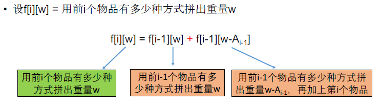
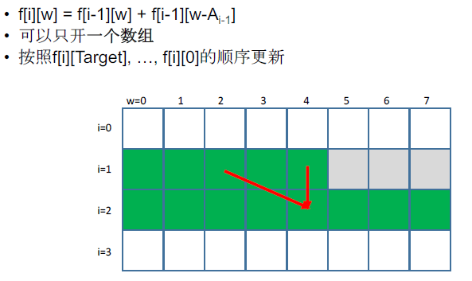

[TOC]

## 题目

### [563. Backpack V](https://www.lintcode.com/problem/backpack-v/description)

Given n items with size `nums[i]` which an integer array and all positive numbers. An integer `target` denotes the size of a backpack. Find the number of possible fill the backpack.

```
Each item may only be used once
```

### Example

Given candidate items `[1,2,3,3,7]` and target `7`,

```
A solution set is: 
[7]
[1, 3, 3]
```

return `2`

## 思路

* 0-1背包型动态规划
  * 
* 背包问题的关键点：背包重量放进状态，放在内循环
* 初始条件$f[0][0] $=1，0个物品可以有一种方式拼出重量0
* 空间优化
  * 


## 代码

```python
class Solution:
    """
    @param nums: an integer array and all positive numbers
    @param target: An integer
    @return: An integer
    """
    def backPackV(self, nums, target):
        # write your code here
        return self.solve1(nums, target)
        
    def solve(self, nums, target):
        
        n = len(nums)
        if n == 0:
            return 0
        
        if sum(nums) == target:
            return 1
        elif sum(nums) <= target:
            return 0
            
        DP = [[0 for i in range(target+1)] for j in range(2)]
        
        DP[0][0] = 1
        for i in range(1, n+1):             # 前i个数
            for j in range(0, target+1):    # 凑成重量j
                DP[i % 2][j] = DP[(i-1) % 2][j]
                if j - nums[i-1] >= 0:
                    DP[i % 2][j] += DP[(i-1) % 2][j - nums[i-1]]
        
        print(DP[n % 2][target])
        return DP[n % 2][target]
    
    def solve1(self, nums, target):
        # 进一步压缩空间 使用一个一维数组实现
        
        n = len(nums)
        
        if n == 0:
            return 0
        
        if sum(nums) == target:
            return 1
        elif sum(nums) <= target:
            return 0
        
        DP = [0 for i in range(target+1)]
        
        DP[0] = 1
        for i in range(1, n+1):
            for j in range(target, -1, -1): # 倒着推 因为是j和j-nums[i-1]这两个旧的值更新j位置的值
                if j - nums[i-1] >= 0:
                    DP[j] = DP[j] + DP[j - nums[i-1]]
        
        return DP[target]
```

