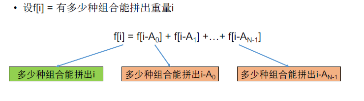

[TOC]

## 题目

### [564. Combination Sum IV](https://www.lintcode.com/problem/combination-sum-iv/description)

Given an integer array `nums` with all positive numbers and no duplicates, find the number of possible combinations that add up to a positive integer `target`.

### Example

**Example1**

```
Input: nums = [1, 2, 4], and target = 4
Output: 6
Explanation:
The possible combination ways are:
[1, 1, 1, 1]
[1, 1, 2]
[1, 2, 1]
[2, 1, 1]
[2, 2]
[4]
```

**Example2**

```
Input: nums = [1, 2], and target = 4
Output: 5
Explanation:
The possible combination ways are:
[1, 1, 1, 1]
[1, 1, 2]
[1, 2, 1]
[2, 1, 1]
[2, 2]
```

### Notice

A number in the array can be used multiple times in the combination.
Different orders are counted as different combinations.

## 思路

* 完全背包型动态规划，但是这里是有顺序的。
* 关注最后一个物品：
  * 

## 代码

```python
class Solution:
    """
    @param nums: an integer array and all positive numbers, no duplicates
    @param target: An integer
    @return: An integer
    """
    def backPackVI(self, nums, target):
        # write your code here
        return self.solve(nums, target)
        
    def solve(self, nums, target):
        
        n = len(nums)
        if n == 0:
            return 0
        
        # DP[i] 有多少种方式能拼出重量i
        
        DP = [0 for i in range(target+1)]
        
        DP[0] = 1
        for i in range(1, target+1):
            for j in range(n):
                if i-nums[j] >= 0:
                    DP[i] += DP[i-nums[j]]
        
        return DP[target]
```

