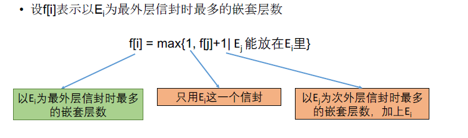

[TOC]

## 题目

### [602. Russian Doll Envelopes](https://www.lintcode.com/problem/russian-doll-envelopes/description)

1. Give a number of envelopes with widths and heights given as a pair of integers `(w, h)`. One envelope can fit into another if and only if both the width and height of one envelope is greater than the width and height of the other envelope.
   Find the maximum number of nested layers of envelopes.

   ### Example

   **Example 1:**

   ```
   Input：[[5,4],[6,4],[6,7],[2,3]]
   Output：3
   Explanation：
   the maximum number of envelopes you can Russian doll is 3 ([2,3] => [5,4] => [6,7]).
   ```

   **Example 2:**

   ```
   Input：[[4,5],[4,6],[6,7],[2,3],[1,1]]
   Output：4
   Explanation：
   the maximum number of envelopes you can Russian doll is 4 ([1,1] => [2,3] => [4,5] / [4,6] => [6,7]).
   ```

## 思路

序列型动态规划。完全不知道怎么做，看答案的


* 以下是九章动态规划专题班讲的解法，但是Python版本过不了，==TLE了==

  ​	这一题的关键在于排序，提前对信封按照长度一维进行排序。

  

## 代码

* ==九章动态规划专题班讲的解法，Python的代码TLE了==

```python
class Solution:
    """
    @param: envelopes: a number of envelopes with widths and heights
    @return: the maximum number of envelopes
    """
    def maxEnvelopes(self, envelopes):
        # write your code here
        return self.solve(envelopes)
    
    def solve(self, envelopes):      
        n = len(envelopes)
        if n == 0:
            return 0
            
        e = envelopes
        e.sort()
        DP = [0 for i in range(n)]
        for i in range(n):
            DP[i] = 1;
            for j in range(i):
                if e[i][0] > e[j][0] and e[i][1] > e[j][1]:
                    DP[i] = max(DP[j] + 1, DP[i])
        return max(DP)
```

