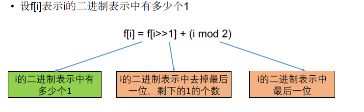

[TOC]

## 题目

### [664. Counting Bits](https://www.lintcode.com/problem/counting-bits/description)

Given a **non negative** integer number num. For every numbers i in the range `0 ≤ i ≤ num` calculate the number of 1's in their binary representation and return them as an array.

### Example

**Example1**

```
Input: 5
Output: [0,1,1,2,1,2]
Explanation:
The binary representation of 0~5 is:
000
001
010
011
100
101
the count of "1" in each number is: 0,1,1,2,1,2
```

**Example2**

```
Input: 3
Output: [0,1,1,2]
```

### Challenge

1. It is very easy to come up with a solution with run time O(n*sizeof(integer)). But can you do it in linear time O(n) /possibly in a single pass?
2. Space complexity should be O(n).
3. Can you do it like a boss? Do it without using any builtin function like __builtin_popcount in c++ or in any other language.

## 思路

位操作型动态规划题目。没有思路，参考了答案。

和位操作相关的动态规划一般用值作状态



## 代码

```python
class Solution:
    """
    @param num: a non negative integer number
    @return: an array represent the number of 1's in their binary
    """
    def countBits(self, num):
        # write your code here
        return self.solve(num)
        
    def solve(self, num):
        
        DP = [0 for i in range(num+1)]
        
        DP[0] = 0
        for i in range(num+1):
            DP[i] = DP[i // 2] if i & 1 == 0 else DP[i // 2] + 1
        return DP
```

