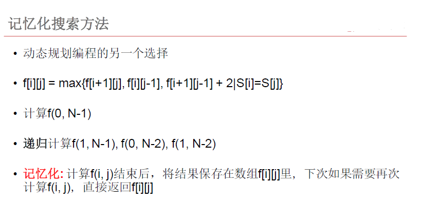
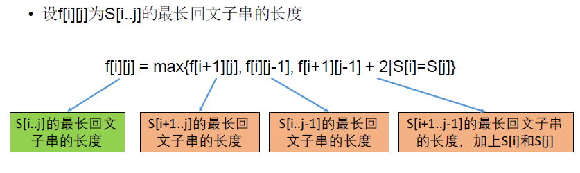

[TOC]

## 题目

### [667. Longest Palindromic Subsequence](https://www.lintcode.com/problem/longest-palindromic-subsequence/description)

Given a string s, find the longest palindromic subsequence's length in s. You may assume that the maximum length of s is `1000`.

### Example

**Example1**

```
Input: "bbbab"
Output: 4
Explanation:
One possible longest palindromic subsequence is "bbbb".
```

**Example2**

```
Input: "bbbbb"
Output: 5
```

## 思路

* 记忆化搜索：即递归解决，但是在递归过程中，确定是否已经计算过当前状态
  * 
* 动态规划：
  * 注意对于区间型动态规划，枚举区间长度是一个不错的编程技巧
  * 答案中给出了怎样打印出最长回文子序列
  * 

## 代码

```python
class Solution:
    """
    @param s: the maximum length of s is 1000
    @return: the longest palindromic subsequence's length
    """
    RE = [[]]
    ss = ""
    n1 = 0
    
    def Compute(self, i, j):
        # 记忆化搜索
        global RE
        global ss
        if RE[i][j] != -1:
            return 
        if i == j:
            RE[i][j] = 1
            return 
        if i + 1 == j:
            RE[i][j] = 2 if ss[i] == ss[j] else 1
            return        
        
        # 递归
        self.Compute(i+1, j)
        self.Compute(i, j-1)
        self.Compute(i+1, j-1)
        
        # DP
        RE[i][j] = max(RE[i+1][j], RE[i][j-1])
        if ss[i] == ss[j]:
            RE[i][j] = max(RE[i][j], RE[i+1][j-1] + 2)
        
        
    
    def longestPalindromeSubseq(self, s):
        # write your code here
        return self.solve2(s)

    def solve2(self, s):
        # 记忆化搜索
        
        global ss
        ss = s
        global n1
        n1 = len(s)
        
        if n1 == 0:
            return 0        
        
        global RE
        RE = [[0 for i in range(n1)] for j in range(n1)]
        
        for i in range(n1):
            for j in range(n1):
                RE[i][j] = -1
        
        self.Compute(0, n1-1)
        
        return RE[0][n1-1]
        
        
        
        
    def solve(self, s):
        
        n = len(s)
        
        if n == 0:
            return 0
        
        # i与j之间的最长回文子序列的长度
        DP = [[0 for i in range(n)] for j in range(n)]
        pi = [[0 for i in range(n)] for j in range(n)]
        
        for i in range(n-1, -1, -1):
            DP[i][i] = 1
            for j in range(i+1, n):
                if i+1 <= n-1:
                    DP[i][j] = DP[i+1][j]
                if j-1 >= 0:
                    DP[i][j] = max(DP[i][j], DP[i][j-1])
                    if DP[i][j] == DP[i][j-1]:
                        pi[i][j] = 1
                    else:
                        pi[i][j] = 0
                    
                if s[i] == s[j]:
                    DP[i][j] = max(DP[i][j], DP[i+1][j-1] + 2)
                    if DP[i][j] == DP[i+1][j-1] + 2:
                        pi[i][j] = 2
        
        res = [0 for i in range(DP[0][n-1])]
        p = 0
        q = DP[0][n-1] - 1
        i = 0
        j = n-1
        while i <= j:
            if i == j:
                res[p] = s[i]
                break
            if i+1 == j:
                res[p] = s[i]
                res[q] = s[j]
                break
            if pi[i][j] == 0:
                i += 1
            else:
                if pi[i][j] == 1:
                    j = j - 1
                else:
                    res[p] = s[i]
                    p += 1
                    res[q] = s[j]
                    q -= 1
                    i += 1
                    j -= 1
        
        print(res)
        return DP[0][n-1]
         
    def solve1(self, s):
        
        n = len(s)
        
        if n == 0:
            return 0
        
        # 
        DP = [[0 for i in range(n)] for j in range(n)]
        
        # 长度为1初始化
        for i in range(n):
            DP[i][i] = 1
        
        # 长度为2初始化
        for i in range(n-1):
            DP[i][i+1] = 2 if s[i] == s[i+1] else 1
            
        # 枚举长度
        for length in range(3, n+1):
            for i in range(n-length + 1):
                j = i + length - 1
                DP[i][j] = max(DP[i+1][j], DP[i][j-1])
                if s[i] == s[j]:
                    DP[i][j] = max(DP[i][j], DP[i+1][j-1] + 2)
        
        return DP[0][n-1]
```

