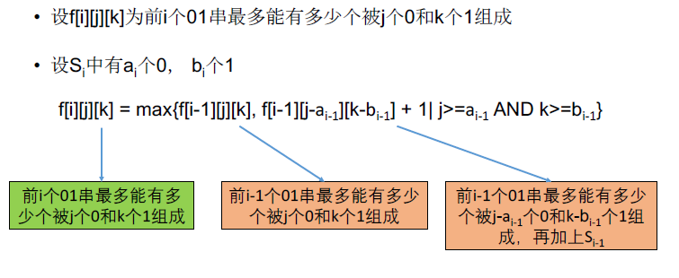

[TOC]

## 题目

### [668. Ones and Zeroes](https://www.lintcode.com/problem/ones-and-zeroes/description)

In the computer world, use restricted resource you have to generate maximum benefit is what we always want to pursue.

For now, suppose you are a dominator of m `0s` and n `1s` respectively. On the other hand, there is an array with strings consisting of only `0s` and `1s`.

Now your task is to find the maximum number of strings that you can form with given m `0s` and n `1s`. Each `0` and `1` can be used at most once.

### Example

**Example1**

```
Input:
["10", "0001", "111001", "1", "0"]
5
3
Output: 4
Explanation: This are totally 4 strings can be formed by the using of 5 0s and 3 1s, which are "10", "0001", "1", "0"
```

**Example2**

```
Input:
["10", "0001", "111001", "1", "0"]
7
7
Output: 5
Explanation: All strings can be formed by the using of 7 0s and 7 1s.
```

### Notice

1. The given numbers of `0s` and `1s` will both not exceed `100`
2. The size of given string array won't exceed `600`.

## 思路

双序列型动态规划



* 可以优化至二维数组

  

## 代码

```python

class Solution:
    """
    @param strs: an array with strings include only 0 and 1
    @param m: An integer
    @param n: An integer
    @return: find the maximum number of strings
    """

    def findMaxForm(self, strs, m, n):
        # write your code here
        l = len(strs)
        
        # f[l][m][n] m个0 n个1 最多组成前l个字符串
        f = [[[0]*(n+1) for _ in range(m+1)] for _ in range(l+1)]

        for i in range(1, l+1):
            O = strs[i-1].count('0')
            I = strs[i-1].count('1')           
            for j in range(m+1):
                for k in range(n+1):
                    if i == 0:
                        f[i][j][k] = 0
                        continue
                    f[i][j][k] = f[i-1][j][k]  # 不加入第i个
                    # 加入第i个
                    if (j - O >= 0) and (k - I >= 0):
                        f[i][j][k] = max(f[i][j][k],f[i-1][j - O][k - I] + 1)
        return f[l][m][n]
    '''
    def findMaxForm(self, strs, m, n):
        # write your code here
        l = len(strs)
        
        # f[l][m][n] m个0 n个1 最多组成前l个字符串
        f = [[0]*(n+1) for _ in range(m+1)]

        for i in range(1, l+1):
            O = strs[i-1].count('0')
            I = strs[i-1].count('1')           
            for j in range(m, -1, -1):
                for k in range(n, -1, -1):
                    if i == 0:
                        f[j][k] = 0
                        continue
                    # 加入第i个
                    if (j - O >= 0) and (k - I >= 0):
                        f[j][k] = max(f[j][k],f[j - O][k - I] + 1)
        return f[m][n]
    ''
```

