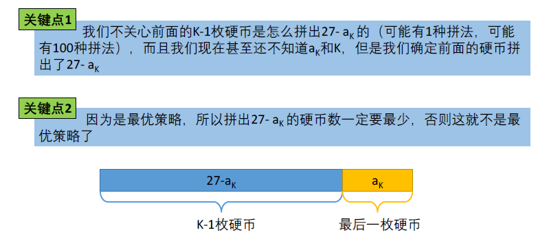

[TOC]

## 题目

### [669. Coin Change](https://www.lintcode.com/problem/coin-change/description)

给出不同面额的硬币以及一个总金额. 写一个方法来计算给出的总金额可以换取的最少的硬币数量. 如果已有硬币的任意组合均无法与总金额面额相等, 那么返回 `-1`.

### 样例

**样例1**

```
输入：
[1, 2, 5]
11
输出： 3
解释： 11 = 5 + 5 + 1
```

**样例2**

```
输入： 
[2]
3
输出： -1
```

### 注意事项

你可以假设每种硬币均有无数个

## 思路

完全背包型动态规划题目。对于背包问题的一个解题原则就是要将背包大小设置为动态规划的状态。这里明显就是总金额为背包大小。所以$f[i]$表示组成总金额为$i$的最少硬币数目

需要注意的一点是最后需要不能组成的情况下返回-1，这里需要特殊处理一下



## 代码

```python
class Solution:
    """
    @param coins: a list of integer
    @param amount: a total amount of money amount
    @return: the fewest number of coins that you need to make up
    """
    def coinChange(self, coins, amount):
        # write your code here
        
        # base case
        return self.DP(coins, amount)

    def DP(self, coins, amount):
        MIN = 10000
        # f[i]表示组成i总金额的最少硬币数目
        f = [MIN for i in range(amount+1)]
        f[0] = 0
        
        for i in range(amount+1):
            for coin in coins:
                if i - coin >= 0 and f[i-coin] != MIN:
                    f[i] = min(f[i-coin]+1, f[i])

        if f[amount] == MIN:
            f[amount] = -1
        
        return f[amount]
```

